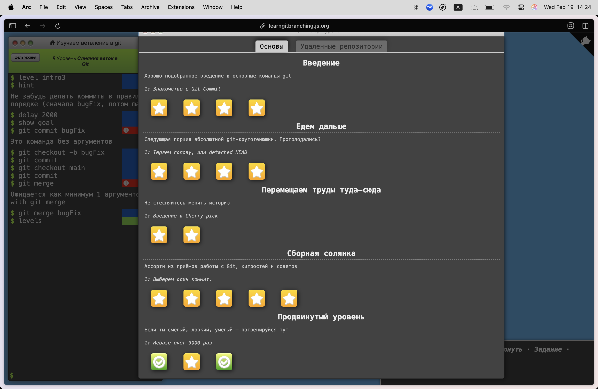

# Семинар 1 задание

#### Проделанная работа: 
1) Удалён весь текст и заменён своим;
2) Ссылка на мой репозиторий с кодом из прошлого семестра: [Link to my repo](https://github.com/BoT-TEMA/inf2sem);
3) Скрин с результатами обучалки:   

>PS: Надеюсь, что всё ОК:)
